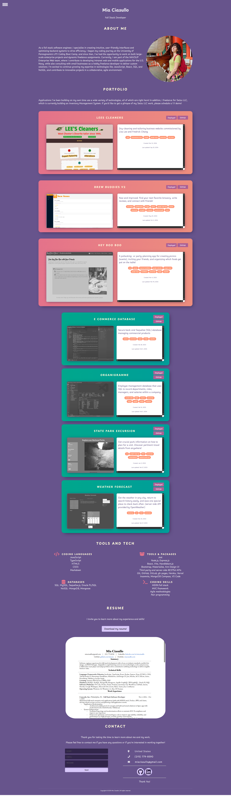

# Professional Portfolio

## Description

This website showcases my abilities to write code in a variety of settings.

## Table of Contents

- [Badges](#badges)
- [Installation](#installation)
- [Tests](#tests)
- [Usage](#usage)
- [Features](#features)
- [Contributors](#contributors)
- [Roadmap](#roadmap)
- [Credits](#credits)
- [Technologies](#technologies)
- [License](#license)

## Badges

## Installation

N/A. For testing purposes, feel free to download the code via SSH, install packages with `npm i`, and test the site locally with `npm run dev`.

## Tests

No tests at this time.

## Usage

Please visit [miaciasullo.com](https://www.miaciasullo.com/)!

## Features

The site uses React and GitHub API to import key information about public projects.

## Contributors

- Mia Ciasullo, developer. Visit on [GitHub](https://github.com/miacias) and on [LinkedIn](https://www.linkedin.com/in/miaciasullo).

## Roadmap

Projects will be added, when possible, if clients from freelancing projects allow.
For future development on thie site specifically, I intend to make full use of React components and break the site into smaller pieces as time allows.

## Credits

### Technologies & Tools used:

- [Vite.js](https://vitejs.dev/) - React development environment
- [VS Code](https://code.visualstudio.com/)

### Tutorials referenced:

- [Nav](https://alvarotrigo.com/blog/hamburger-menu-css/) - creating a decorated hamburger menu
- [Contact form](https://codepen.io/bobbykorec/pen/qOGbyr) - CSS layout
- [Resume embed](https://stackoverflow.com/questions/36146508/google-docs-iframe-how-to-customize-the-css-of-an-embedded-google-docs-iframe) - modifying embedded documents
- [Gradient animator](https://www.gradient-animator.com/) - creating animated css gradients
- [Box shadow](https://www.cssmatic.com/box-shadow) - creating css box shadows
- [React Prop Types](https://legacy.reactjs.org/docs/typechecking-with-proptypes.html) - legacy prop type validation (non-TypeScript)
- [Domain redirect](https://jorgearuv.dev/setting-up-namecheap-domain-in-vercel) - send Vercel deploy to custom domain

### Artist(s):

- [Color Palette](https://mycolor.space/?hex=%2367548C&sub=1) - theme colors
- [Dog favicon](https://www.flaticon.com/free-icon/dog_1723750?term=dog&page=1&position=25&origin=tag&related_id=1723750)

## Screenshots

